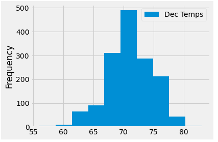
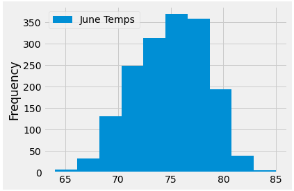
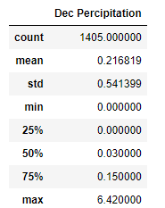
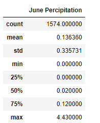
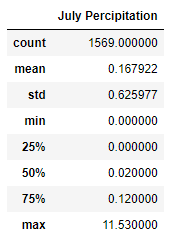

# Surfs Up

## Overview

Mr. Avy is interested in opening an ice cream and surf shop in Hawaii.  He is really interested in the weather in the months of June and December, and wants to make sure that the shop will be successful all year long.  

## Results

- When it comes to the temperature, June has a mean of 74.9 degrees and December has an average temperature of 71 degrees.  Both months have maximum temperatures, from this data set, of low to mid 80's, which is perfect for both surfing and eating ice cream.  December did have a few cold days, where the temperature dropped in to the 50's, which may not be the best weather for either activity.  From this histograms of both months, we can see that the temperatures tend to be at least 70 degrees most days.  

## Summary
With ice cream sales and surfing, we should also look at the amount of rain that Hawaii is receiving during this time as well.  If it is a very rainy month, people may not want to come out to surf or get ice cream.  Both June and December seem to be months  with not too much rain, as seen in the summary tables

There could definitly be a need to check more months out, since June and December may not be considered the rainy months.  July, on average did not have more rain, but the maximum amount of rain was almost twice that of December.  The summer months may have more days with large amounts of rainfall.  

The rain could be an indicator of days of not so great weather, such as storms that Mr. Avy would need to be cautious of.  
Overall, June and December seem to be great months to enjoy surfing and ice cream in Hawaii.  
